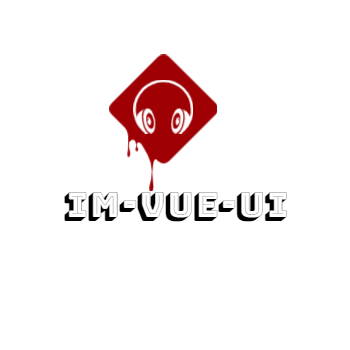

# vue-ui

    

vue2.0 class 写法的 vue 组件库

### BEM css 规范

1. B(block): 独立且有意义的实体, e.g. header, container, menu, checkbox.
2. E(element) : Block 的一部分且没有独立的意义, header title, menu item, list item
3. M(modifier) : Blocks 或 Elements 的一种标志，可以用它改变其表现形式、行为、状态 disabled, checked,fixed

命名规则: 通过双下划线`__`连接后代 block 或者 element ,用双连字符`--`连接修饰语。

### 主题颜色的命令规范

1. @--color- 开头的变量任何地方都可以使用
2. @--text- 开头的只能使用为文本色
3. @--bg- 开头的只能使用为背景色
4. @--border- 开头的只能使用为边框
5. @--hover- 开头的只能使用为鼠标悬浮情况
6. @--active- 开头的只能使用激活情况
7. @--button- 开头的只能使用为 按钮

### 中介者设计模式

1. 外部衔接组件用于处理组件各种扩展功能
2. 内部只需要处理数据展现相关的逻辑.
